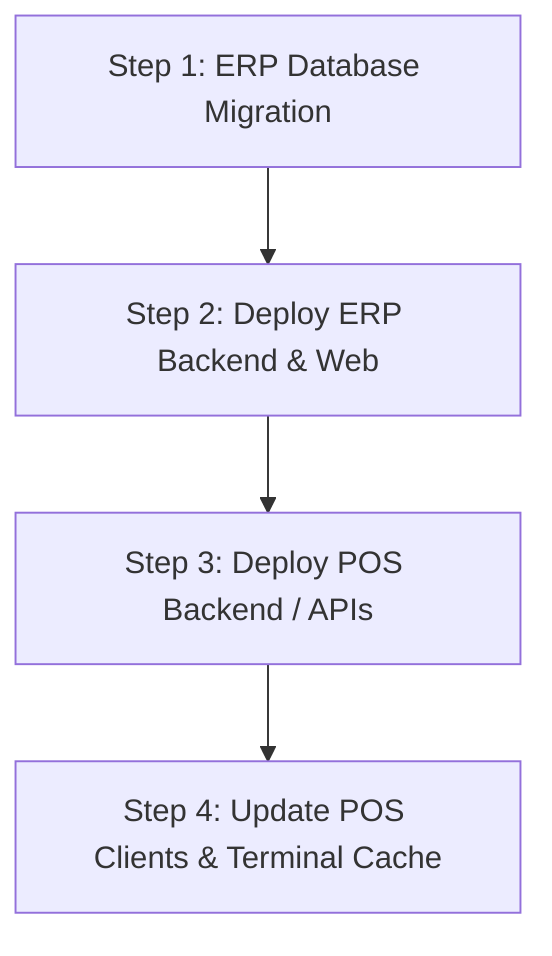

# Production Rollout & Operational Migration Guide
**Change:** `revise-pos-erp-daily-operations`  
**Target Environments:** `harmony-kitchen-erp` & `harmony-kitchen-pos`  
**Date:** September 2026  

---

## 1. Executive Summary & Boundaries

This release delivers coordinated improvements across POS daily operations and ERP inventory management:
- **POS Fresh Quoting & Snapshot Integrity:** Real-time database price lookups on barcode/item selection, decoupled Retail / Grosir 1 switch (future selections only), and complete preservation of unit-price snapshots across line edits, checkout, and reprint.
- **Strict Server-Side HPP Confidentiality:** Authorization gate on `inventory.viewHpp` enforced at database projection, export, detail cards, and receiving views. The `Admin` userLevel alone **never** bypasses explicit grant checks.
- **Daily Recap (Rekap Harian):** Strict `Asia/Jakarta` (UTC+7) calendar date boundaries, self-cashier restriction with supervisor override (`reports.viewAllCashiers`), and payment reconciliation including legacy data fallbacks.
- **Table Usability & Column Persistence:** Resizable "Nama Barang" columns with draggable borders and `-`/`+`/`reset` buttons, user-isolated via `localStorage` keys (`user_<id>`), and full wrapping without truncation.
- **Server-Only Inventory XLSX Export:** Fast, secure ExcelJS streaming with `@` leading-zero text formats for barcodes, formula injection sanitization (`'`), and strict omission of HPP columns for restricted users.
- **Explicit Boundary Reminder:** F3 Goods Receiving workflow changes remain **strictly deferred**. Receiving screens have received only layout readability updates and server HPP masking; no receiving stock, PO, or costing workflows have been modified.

---

## 2. Permission Bootstrap Procedure

By security design, default `Admin` role does **not** grant automatic visibility of HPP. This prevents accidental exposure to floor supervisors or third-party administrators.

### Step-by-Step Named Account Bootstrap:

1. **Identify Authorized Financial Stakeholder(s):**
   Determine the exact user accounts permitted to see Cost of Goods Sold (HPP) and manage grants.

2. **Execute Database Seed / Bootstrap Command:**
   Run the administrative bootstrap script:
   ```bash
   npx tsx scripts/bootstrap-grants.ts --username="owner_account" --grant="inventory.viewHpp,auth.manageGrants,reports.viewAllCashiers"
   ```
   Or via direct SQL query on PostgreSQL:
   ```sql
   -- 1. Get target user ID
   SELECT id, username, "full_name" FROM "m_user" WHERE username = 'owner_account';

   -- 2. Insert explicit grants
   INSERT INTO "t_user_grant" ("user_id", "permission_key", "created_at")
   VALUES 
     (TARGET_USER_ID, 'inventory.viewHpp', NOW()),
     (TARGET_USER_ID, 'auth.manageGrants', NOW()),
     (TARGET_USER_ID, 'reports.viewAllCashiers', NOW())
   ON CONFLICT ("user_id", "permission_key") DO NOTHING;
   ```

3. **Verify Authorization:**
   - Log in with `owner_account`.
   - Access ERP **Master Barang**: HPP column, Total Nilai Persediaan card, and HPP History tabs are visible.
   - Access ERP **User Access Management**: Ability to assign/revoke grants to other users is enabled.
   - Log in with ordinary cashier or admin without grant: HPP columns are entirely absent; API direct requests return `null` HPP or `403 Forbidden`.

---

## 3. Timezone Configuration (Asia/Jakarta / UTC+7)

- **Standard Timezone:** Both servers and database queries must consistently interpret transaction timestamps within `Asia/Jakarta` (WIB, UTC+7).
- **Recap Boundaries:**
  - Day Start: `YYYY-MM-DDT00:00:00.000+07:00`
  - Day End: `YYYY-MM-DDT23:59:59.999+07:00`
- **Database Storage:** Prisma stores timestamps in UTC `timestamptz`. The daily recap API translates input date `YYYY-MM-DD` to the exact UTC instant matching midnight WIB to avoid transactions on either side of midnight falling into incorrect recap days.

---

## 4. Zero-Downtime Deployment Ordering

To maintain seamless backward compatibility and prevent client errors, deploy services in the following order:



1. **Step 1: ERP Database Migration**
   - Apply Prisma migration to PostgreSQL:
     ```bash
     npx prisma migrate deploy
     ```
   - Adds nullable display snapshots (`snapshot_name`, `snapshot_unit`, `price_type`, `quote_ref`) to `t_sales_pos_detail`.
   - Replaces unique constraint `[header_id, barcode]` with non-unique index `idx_sales_pos_detail_header_barcode`.
   - Adds `t_auth_session` and `t_user_grant` tables.

2. **Step 2: Deploy ERP Web Application**
   - Start updated `harmony-kitchen-erp`.
   - ERP now enforces server HPP projections, user-isolated column widths, and server-side XLSX export.

3. **Step 3: Deploy POS Application**
   - Start updated `harmony-kitchen-pos`.
   - POS provides `/api/products/quote` endpoint and accepts immutable unit-price selections.

4. **Step 4: Reload POS Terminal Clients**
   - Refresh browser terminals (`Ctrl + F5`).
   - Terminals automatically migrate existing localStorage carts to `hk_pos_cart_v2` with stable line IDs.

---

## 5. Rollback Limits & Data Invariant Notes

> [!CAUTION]
> **Database Invariant Warning on Rollback:**
> Once live transactions have been posted that contain multiple rows for the same product at different prices (e.g. 2 PCS at Retail Rp 50.000 and 5 PCS at Grosir 1 Rp 45.000 in the same invoice), **the database can no longer be rolled back to the legacy schema constraint** `[header_id, barcode] UNIQUE`.
> 
> Attempting to re-apply the old unique constraint will fail with a Postgres unique constraint violation (`23505`) and cause checkout outages.

### Safe Rollback Procedure (If needed during deployment window):
- If rolled back before any mixed-price transactions occur: standard Prisma rollback is possible.
- If rolled back after mixed-price transactions occur: do **not** re-apply the unique constraint. Simply rollback frontend application code while keeping the relaxed database schema.
